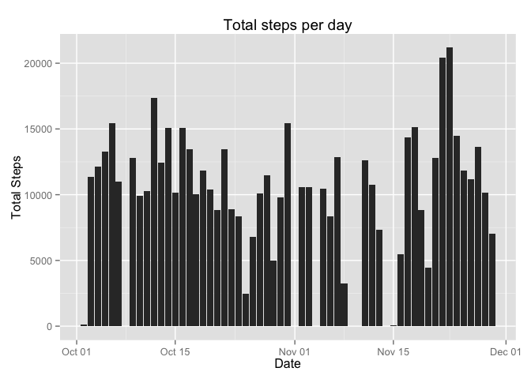
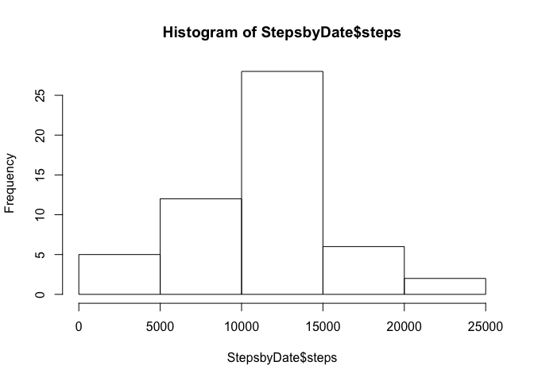
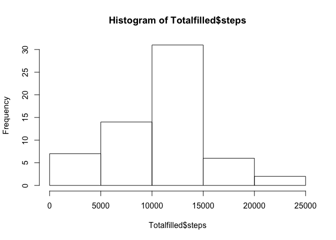
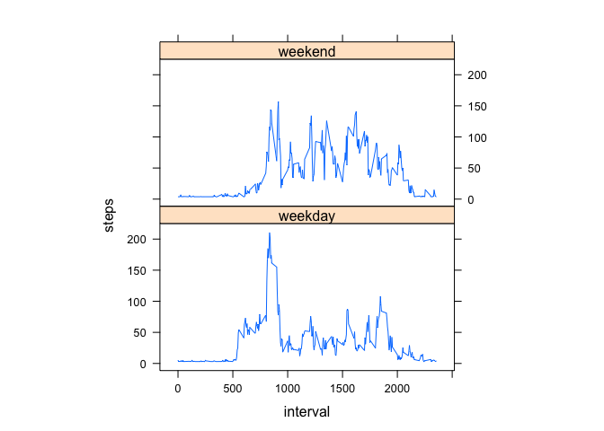

# Reproducible Research: Peer Assessment 1


## Loading and preprocessing the data

```r
library(ggplot2)
library(data.table)
library(lattice)
unzip("activity.zip")
activitydata <- read.csv("activity.csv")
#clean data
good <- complete.cases(activitydata)
cleandata <- activitydata[good, ]
```


## What is mean total number of steps taken per day?

```r
# generate total number of steps per day
StepsbyDate <- aggregate(steps ~ date, data = cleandata, sum)
StepsbyDate$date <- as.Date(StepsbyDate$date)
```
 
 

```r
# generate mean number of steps per day
meansteps <- round(mean(StepsbyDate$steps))
sprintf("The mean of total number of steps taken per day: %s", meansteps)
```

```
## [1] "The mean of total number of steps taken per day: 10766"
```

```r
# generate median number of steps per day
mediansteps <-median(StepsbyDate$steps)
sprintf("The median of total number of steps taken per day: %s", mediansteps)
```

```
## [1] "The median of total number of steps taken per day: 10765"
```

## What is the average daily activity pattern?

```r
# generate steps~interval relations
Interval <- aggregate(steps ~ interval, data = cleandata, mean)
```
 

```r
#calculate average of the maximun number of steps
AverageMaxsteps <- Interval[which.max(Interval$steps),]
sprintf("average across all maximum number of steps: %s", AverageMaxsteps$steps)
```

```
## [1] "average across all maximum number of steps: 206.169811320755"
```
## Imputing missing values

```r
#calculate number of missing data
missingdata <- sum(is.na(activitydata$steps))
sprintf("%s number of inputs are missing", missingdata)
```

```
## [1] "2304 number of inputs are missing"
```

```r
#fill the missing data using mean steps of each day
MeanStepsbyDate <- data.table(aggregate(steps ~ date, data = cleandata, mean))
setkey(MeanStepsbyDate$date)
datafilled<- activitydata
for(i in 1:nrow(datafilled)){
                if(is.na(datafilled[i, ]$steps)){
                        datafilled[i, ]$steps <- MeanStepsbyDate$steps[datafilled[i, ]$date] 
                }
        }
       
# recalculate the total steps
Totalfilled <- aggregate(steps ~ date, data = datafilled, sum) 
```
 

```r
# recalculate the mean and median steps
meansteps2 <- round(mean(Totalfilled$steps))
sprintf("The mean of total number of steps taken per day: %s", meansteps2)
```

```
## [1] "The mean of total number of steps taken per day: 10448"
```

```r
mediansteps2 <-median(Totalfilled$steps)
sprintf("The median of total number of steps taken per day: %s", mediansteps2)
```

```
## [1] "The median of total number of steps taken per day: 10585.5"
```
## Are there differences in activity patterns between weekdays and weekends?

```r
# seperate weekend and wekday
datafilled$day = ifelse(as.POSIXlt(as.Date(datafilled$date))$wday%%6 == 0, "weekend", "weekday")
Interval2 = aggregate(steps ~ interval + day, datafilled, mean)
datafilled$day = factor(datafilled$day, levels = c("weekday", "weekend"))
```
 
